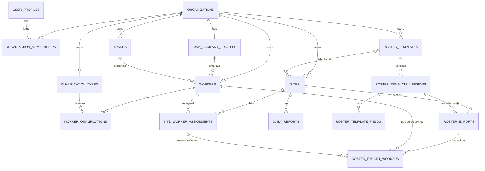

# 建設現場業務アプリ アーキテクチャ監査

- 監査日: 2026-07-14
- 更新日: 2026-07-16（顧客所有本番・セキュリティ・オンライン専用・クライアントPDF方針を反映）
- 対象リポジトリ: `ryo065492-cpu/ap-checker-pwa`
- 監査基準点: `main` / `afabafcedb3ba2a35e3e9de3f9508923119412b8`
- 本文の位置づけ: 本番実装前の監査履歴。Phase 0Aの匿名UI/PDF PoCは完了済み。本番の現在の正本は `docs/SECURITY_REQUIREMENTS_JA.md` と `docs/PRODUCTION_ARCHITECTURE_JA.md` とし、本文中の古い提案と矛盾する場合は両文書を優先する。

## 0. 結論と判定区分

### 結論

現状は、業務領域、スマホUI、名簿作成5工程、国土交通省様式の匿名UI/PDF PoCまで完了している。本番は、依頼者が所有する1社専用環境、Supabase東京リージョン、招待制Auth、全利用者MFA、RLS、オンライン専用、匿名開発、納品後の開発者権限0を採用する。ブラウザ内PDF生成を第一候補として匿名スパイクを行い、正式品質を満たすまで本番方式として確定しない。実データ投入は、`docs/SECURITY_REQUIREMENTS_JA.md` のP0全件合格後に限る。

推奨方針は次のとおり。

1. 現リポジトリは匿名PoCと検討履歴の保管場所として維持する。
2. Phase 0Aの匿名UI/PDF PoCは完了済みとし、本番コードへ直接コピーしない。
3. 本番コードは依頼者所有の専用非公開リポジトリへ新規実装する。構築中は匿名データだけを使い、実データ投入前に諒さんの本番権限を削除して全秘密情報を依頼者側で再発行する。
4. 本番は静的React + TypeScriptアプリ、依頼者所有のSupabase東京、招待制Auth、TOTP MFA、Postgres RLSを採用する。PWA、Service Worker、オフライン同期はMVPに含めない。
5. 最初の本番MVPは、自社1社の作業員だけを対象に、承認された様式1種類を使った「作業員・現場・現場別作業員情報から名簿PDFを作る」縦断機能に限定する。ただし資格証明書保存、PDF履歴、出力スナップショット保存、複数組織対応は、必要性の確認前に初期必須としない。
6. Phase 0AのPDF方式はHTML/CSS + Chromium/Playwrightで完了済み。本番は公式背景・座標・Noto Sans JPを使うブラウザ向け`pdf-lib`を第一候補とし、1/8/9名、長文、背景、日本語、低性能スマホを匿名データで再検証する。
7. v6/v9からは情報設計、文言、画面遷移、デザイントークン、操作モデルを継承し、単一HTML、グローバル状態、`localStorage`、デモデータ、未エスケープの `innerHTML` は継承しない。

### 判定区分

本文では、事実と提案を次のラベルで区別する。

| ラベル | 意味 |
| --- | --- |
| **確定要件** | 引継ぎ資料または `AGENTS.md` で確定事項として明記されている内容 |
| **監査所見** | 対象資料・プロトタイプを読んで確認できた現状または問題 |
| **提案** | 本番設計に向けた推奨案。承認後に確定する内容 |
| **確認事項** | 資料だけでは確定できず、実装前に業務判断が必要な内容 |

Phase 0Aに対する今回の明示指示は**確定要件**として扱う。ただし、PoC内で採用する仮定を本番要件へ昇格させない。「基準帳票」はPoCの比較・検証基準を意味し、実際の提出先における正式採用とは区別する。

### 監査対象

- `AGENTS.md`
- `docs/PROJECT_HANDOFF_JA.md`
- `docs/CODEX_HANDOFF_JA.md`
- `deme-ui-foundation-v6/index.html`
- `deme-roster-master-v9/index.html`
- 国土交通省「作業員名簿（作成例）」掲載ページ
- 公式Excel `001389323.xlsx`
- 公式プレビュー画像 `001389315.jpg`
- 2026-07-14の匿名PDF PoC実装指示

### 現状の技術状態

- **監査所見**: 現リポジトリは複数世代の単一HTMLプロトタイプを中心とし、ルートには本番アプリ用の `package.json`、TypeScript設定、アプリケーション用テスト構成は存在しない。Phase 0Aの独立領域に置くPoC用設定・テストとは区別する。
- **監査所見**: v6/v9はそれぞれ別の `localStorage` キー、デモデータ、グローバルな可変状態を使う独立プロトタイプで、共通の永続データ層ではない（`deme-ui-foundation-v6/index.html:30-35`、`deme-roster-master-v9/index.html:20-25`）。
- **監査所見**: 認証、クラウドDB、本番PDF、アプリケーションテストは未実装であり、v6/v9は見た目、文言、画面遷移、情報設計の参照資料という位置づけである（`docs/CODEX_HANDOFF_JA.md:52-64`）。Phase 0Aの匿名PDFは本番PDFとは別である。
- **監査所見**: `poc/roster-pdf/` のPhase 0Aは独立した生成・検証環境であり、ルートの本番アプリ構成、認証、DB、PWAが開始されたことを意味しない。
- **監査所見**: `poc/roster-ui/index.html` は既存の匿名PDFへリンクするUI PoCであり、UI入力から動的PDFを生成していない。
- **監査所見**: 本番アプリ、Supabase migration、Auth、MFA、RLS、顧客所有の配信環境は未実装である。

### 確定要件の要約

- **確定要件**: スマートフォン運用が必須で、ホーム画面を業務の起点とする。マスター管理と書類作成を分離する（`AGENTS.md:26-36`、`docs/PROJECT_HANDOFF_JA.md:140-155`）。
- **確定要件**: 主要タップ領域は44px以上、360px・390px・430px幅で破綻させず、PDFプレビュー以外で横スクロールを発生させない（`docs/CODEX_HANDOFF_JA.md:25-35`）。
- **確定要件**: 日報の初期項目は日付、現場、作業内容、人工、残業、備考。人工・残業は0.5単位を主操作とし、直接入力も可能にする。勤務時間は `人工 × 8時間` で算出する（`AGENTS.md:31-33`、`docs/PROJECT_HANDOFF_JA.md:21-36`、`docs/CODEX_HANDOFF_JA.md:37-43`）。
- **確定要件**: 紙の日報は当日提出し、その内容を後からアプリへ入力する。アプリは当日提出の代替手段ではなく、後入力・集計の手段とする。当日分と月次一覧を分離し、日報入力画面へ月累計を表示しない（今回の明示指示、`docs/CODEX_HANDOFF_JA.md:37-43`）。
- **確定要件**: 出面表は現場別・月別で、1行を現場全体の日別合計とし、日報から人工・勤務時間・残業を集計する。出面表へ日常的に直接入力しない（`docs/PROJECT_HANDOFF_JA.md:38-44`）。
- **確定要件**: 作業員マスター、現場マスター、現場別作業員情報を別エンティティにする。名簿作成は、現場選択、作業員選択、現場別情報確認、不足チェック、PDFプレビュー、生成・共有の順とする（`AGENTS.md:35-36`、`docs/PROJECT_HANDOFF_JA.md:46-55`）。
- **確定要件**: 初期版で管理・名簿出力するのは自社作業員のみとする。協力会社作業員、所属会社選択、複数の名簿作成会社管理、会社別分割は実装せず、自社情報は1社分だけ管理する。PDFは選択した自社作業員だけを出力する。
- **確定要件**: 一次会社名、一次会社事業者ID、自社施工次数は現場情報として管理する。一次会社は作業員の所属会社マスターではない。
- **確定要件**: 健康診断日はMVP対象外とし、利用目的・権限・保持期間が別途承認されるまで収集しない。
- **確定要件**: 不足チェックは不足内容だけでなく、修正すべき画面へ利用者を誘導する（`docs/CODEX_HANDOFF_JA.md:45-50`）。
- **確定要件**: 車両、距離、深夜残業、費用、請求・清算項目は初期の日報入力から除外する（`docs/PROJECT_HANDOFF_JA.md:57-72`）。
- **確定要件**: Phase 0Aの初期基準帳票は、国土交通省「作業員名簿（作成例）」とする。A3横、1ページ8名とし、公式プレビュー画像をページ背景に使用する。
- **確定要件**: 国土交通省様式に存在しない内部項目は初期帳票の必須項目にしない。送り出し教育日は内部項目として保持できるが、この帳票には出力しない。CCUS未登録者の現場ID、事業者ID、技能者IDは空欄を許可する。
- **確定要件**: Phase 0Aは実在しない匿名データのみを使用し、利用者文字列をHTMLとして解釈せず、`localStorage`を使用しない。
- **確定要件**: 既存プロトタイプは設計履歴として保存し、削除・改名・上書きしない。本番コードとしてコピーしない（`AGENTS.md:38-51`、`docs/CODEX_HANDOFF_JA.md:52-64`）。
- **確定要件**: 本番は依頼者所有の1社専用環境とし、納品後の諒さんに本番DB、秘密鍵、ログ、バックアップ、デプロイ権限を残さない。
- **確定要件**: 開発・レビュー・保守は匿名データだけで行い、本番データを開発環境へ複製しない。
- **確定要件**: 本番は招待制、個人別ID、全利用者MFA、RLSを必須とし、P0完了前に実データを登録しない。
- **確定要件**: 初期版はオンライン専用とし、PIIを`localStorage`、`sessionStorage`、IndexedDB、Service Worker Cacheへ保存しない。

---

## 1. 推奨リポジトリ構成

### 1.1 選択肢の比較

| 選択肢 | 評価 | 判断 |
| --- | --- | --- |
| v6/v9を直接拡張する最小修正 | 初動は速いが、単一HTML、`localStorage`、認証・DB・テスト不在を抱えたままになる。プロトタイプ保存方針にも反する | **不採用** |
| 現リポジトリを整理し、新しい `apps/web` などへ本番コードを追加 | プロトタイプを同じ場所で参照しやすい。一方、設計履歴と本番コードが混在し、リポジトリ名と用途も一致しない | **代替案** |
| 専用リポジトリへ新規実装し、現リポジトリは設計履歴として残す | 責務、権限、CI、リリース履歴を分離できる。既存プロトタイプを確実に保全できる | **推奨** |

**確定要件**: 本番は依頼者所有の専用非公開リポジトリへ新規実装する。現リポジトリは匿名PoCと監査履歴として維持する。

### 1.2 推奨構成

小規模な初期開発では、Vite + React + TypeScriptの静的SPAを機能単位で分割する。SSR、Server Actions、ホスティングFunctionを初期構成に持たず、PIIの送信先をSupabaseへ限定する。

```text
construction-operations-app/
├─ docs/
│  ├─ decisions/                    # ADR: 技術・権限・PDF方式の決定記録
│  ├─ data-dictionary.md            # 正式帳票を元にした項目定義
│  ├─ security-and-retention.md     # 個人情報、保存期間、権限
│  └─ pdf-templates/                # 様式仕様とマッピング説明。生成PDFは保存しない
├─ public/
│  ├─ icons/
│  └─ fonts/                        # 埋込み許諾を確認したフォントのみ
├─ src/
│  ├─ routes/                        # login、MFA、保護画面、ホーム、各業務route
│  ├─ features/
│  │  ├─ auth/
│  │  ├─ workers/
│  │  ├─ sites/
│  │  ├─ site-worker-assignments/
│  │  ├─ rosters/
│  │  │  ├─ components/
│  │  │  ├─ schemas/
│  │  │  ├─ services/
│  │  │  └─ renderers/              # テンプレート別PDFレンダラー
│  │  ├─ daily-reports/
│  │  └─ attendance/
│  ├─ components/
│  │  ├─ ui/                        # 汎用プリミティブ
│  │  └─ layout/                    # AppShell、Header、BottomNavigation
│  ├─ lib/
│  │  ├─ validation/
│  │  ├─ dates/
│  │  └─ logging/
│  ├─ infrastructure/
│  │  ├─ supabase/                 # publishable key + user JWTだけを使用
│  │  └─ pdf/                      # ブラウザ内PDFレンダラー
│  ├─ styles/
│  └─ test/
├─ supabase/
│  ├─ migrations/
│  ├─ seed.sql                      # 匿名化した開発データのみ
│  └─ tests/                        # 制約・RLSテスト
├─ tests/
│  ├─ e2e/
│  ├─ fixtures/
│  └─ pdf-golden/                   # 匿名化した期待帳票
├─ .env.example                     # 秘密値を含めない
├─ package.json
├─ tsconfig.json
└─ README.md
```

### 1.3 境界のルール

- **確定要件**: `src/routes` はルーティングと画面構成、`src/features` は業務機能、`src/components/ui` は業務知識を持たない共通部品に限定する。
- **確定要件**: ブラウザにはpublishable keyと利用者JWTだけを渡し、secret key、`service_role`、DBパスワードを置かない。
- **提案**: 画面からSupabaseテーブルを無秩序に操作せず、機能ごとのrepository境界でquery、validation、error変換を集約する。
- **提案**: プロトタイプのCSS/JavaScriptをコピーせず、デザイントークンと操作意図を新しいコンポーネントとして再実装する。
- **確定要件**: 本番配信へ直接deployできる権限を納品後の諒さんに残さない。

### 1.4 Phase 0Aの独立領域

**確定要件**: 匿名PDF PoCは既存プロトタイプや将来の本番コードから分離し、現リポジトリの `poc/roster-pdf/` にだけ作成する。

```text
poc/roster-pdf/
├─ assets/またはsource/             # 公式原本。取得元・hashを記録
├─ src/
│  ├─ config/                       # 座標、文字サイズ、用紙・ページ設定
│  ├─ data/                         # 実在しない匿名fixture
│  ├─ model/                        # PoC用の6つのデータ境界
│  └─ render/                       # 安全なHTML生成、自社作業員の8名単位改ページ
├─ scripts/                         # PDF生成と検証
├─ tests/                           # 境界値・用紙・背景・日本語の自動確認
└─ output/
   └─ roster-poc.pdf                # 正式確認用成果物はこの1件
```

- **確定要件**: 座標と文字サイズは一か所の設定ファイルに集約する。
- **確定要件**: 公式Excelは参照用とし、一般的なExcelライブラリで再保存しない。
- **確定要件**: 本番DB、認証、Supabase、PWA、実データ保存、資格証明書保存、PDF履歴、出力スナップショット保存、複数組織対応をPhase 0Aへ持ち込まない。
- **確定要件**: 初期版は自社1社・自社作業員だけを扱い、協力会社作業員、所属会社選択、複数の名簿作成会社管理、会社別分割を製品要件にしない。PDF生成器に残る汎用的な会社グループ処理は未使用の内部実装であり、現在のPoC・MVP要件ではない。

---

## 2. 推奨技術構成と選定理由

### 2.1 Phase 0Aの確定技術

| レイヤー | 採用方式 | 理由・制約 |
| --- | --- | --- |
| 帳票原本 | 国土交通省公式プレビュー画像 | A3横ページの背景として100%表示し、欠け・余白・自動拡縮を発生させない |
| 可変文字 | HTML/CSSの絶対座標配置 | 公式背景を変更せず、座標と文字サイズを設定へ集約できる |
| PDF生成 | ChromiumまたはPlaywright | 印刷CSSを使いA3横PDFを再現し、自動検証へ接続できる |
| フォント | 同梱 `Noto Sans JP` | 実行環境依存の文字化け・文字幅差を抑える。PoCではフォント本体のhashを固定し、SIL Open Font License 1.1を同梱する |
| データ | コード内の匿名fixture | 実在人物、外部DB、ブラウザ永続化を使わない |

- **確定要件**: `@page` とPDF生成オプションの双方でA3横、余白なし、印刷背景ありを指定し、Chromiumのヘッダー・フッターと自動縮尺を無効にする。
- **確定要件**: 入力値をHTMLとして連結する場合は必ずエスケープし、DOMへ設定する場合は `textContent` 相当を使う。未エスケープの `innerHTML` を使わない。
- **確定要件**: `localStorage`を使わず、PDF生成のたびに匿名fixtureから再現可能な入力を構成する。

### 2.2 本番技術の確定方針

依存バージョンと料金プランは実装時に固定するが、データフローとセキュリティ境界は次で確定する。Phase 0AのNode/Chromium構成をそのまま本番構成とみなさない。

| レイヤー | 推奨 | 選定理由 |
| --- | --- | --- |
| Webアプリ | Vite + React + TypeScript `strict` の静的SPA | SSR/API/Server Actionsを持たず、画面配信層へPIIを送らない単純な境界にする |
| オフライン | MVPではPWA、Service Worker、IndexedDB、オフライン同期を不採用 | 端末へのPII残置と同期競合を初期scopeへ持ち込まない |
| UI | Tailwind CSS + CSS変数のデザイントークン + Radix UI系プリミティブ | v6/v9の見た目を維持しつつ、Bottom Sheet、Dialog、Select等のアクセシビリティを標準化しやすい |
| フォーム | React Hook Form + Zod | 長いマスター入力の状態管理と、画面・サーバーで共有する型付きバリデーションに適する |
| DB | 依頼者所有のSupabase Postgres / Tokyo | PIIの正本を1か所へ限定し、関係制約とRLSを適用する |
| 認証・認可 | 招待制Supabase Auth + TOTP MFA + Postgres RLS | 公開登録を止め、MFA済みJWT、active membership、roleをDBで確認する |
| ファイル | MVPではStorage不採用 | 資格証明書、生成PDF、履歴、snapshotを保存しない |
| PDF | ブラウザ向け`pdf-lib`を第一候補 | 公式背景、固定フォント、既存座標を利用し、PDF bytesをサーバーへ送らない。匿名スパイクの合格後に確定する |
| 単体・結合テスト | Vitest + Testing Library | 計算、バリデーション、コンポーネント、レンダラー入力の高速検証 |
| E2E | Playwright | 360/390/430px、入力、未保存確認、名簿作成フロー、権限別導線を実ブラウザで検証 |
| DB・権限テスト | SQLテスト / Supabaseローカル環境 | 未認証、MFA未完了、無効利用者、別organization、role偽装を自動拒否する |
| 品質 | ESLint、Prettier、`tsc --noEmit`、CI | 本番コード開始時点からlint、型、テスト、ビルドを必須化する |

### 2.3 技術選定上の注意

- **確定要件**: 依頼者がSupabase東京リージョンを契約・所有し、DPA、再委託先、処理地域、バックアップをP0で確認する。
- **確定要件**: MVPはオンライン専用とし、PWA、Service Worker、IndexedDB、オフライン同期を実装しない。
- **確定要件**: 単一顧客でも`organizations`とmembershipをRLSの認可境界として実装する。これは複数組織切替や複数会社管理を提供することを意味しない。
- **確定要件**: Supabase Authは`persistSession: false`を初期値として認証情報をメモリ保持し、再読込時は再ログインさせる。利便性のため永続化する場合は別途リスク承認を行う。
- **確認事項**: 資格証明書、生成PDF、PDF履歴、出力時点のスナップショットを保存する必要性と保持期間は、それぞれの機能採用後に決める。これらを本番MVP開始の一括ブロッカーにしない。
- **提案**: 監視・エラー収集を導入する場合、氏名、住所、電話、保険情報、帳票内容をログや外部分析へ送らない。導入サービスは別途承認を得る。
- **提案**: バージョンは実装開始時に公式サポート状況を再確認して固定し、ロックファイルをコミットする。

---

## 3. データモデル

### 3.1 確定しているデータ境界

- **確定要件**: 作業員情報、現場情報、現場別作業員情報、会社・施工次数情報、名簿出力情報、資格・教育情報を分離する。
- **確定要件**: 日報は現場単位で管理し、勤務時間は人工から算出する。
- **確定要件**: 出面表は日報から派生する。日常の直接入力先にしない。
- **提案**: 元請テンプレートは原本、バージョン、フィールドマッピングを分離する。
- **確認事項**: PDF出力履歴や出力時点の不変スナップショットを保存する必要があるかは未確定であり、Phase 0Aおよび本番MVPの初期必須にしない。必要性が確認された場合だけ、保存目的・最小項目・保持期間を決めて追加する。

### 3.2 Phase 0Aの非永続モデル

Phase 0AではDBテーブルを作らず、次の責務を型またはオブジェクトとして分ける。以下の列名は概念例であり、公式Excel・プレビューとのマッピングを確認した上で実装名を決める。

| データ境界 | 主な内容 | PoC上のルール |
| --- | --- | --- |
| 作業員情報 | 匿名内部ID、氏名、生年月日、帳票上の個人項目、技能者ID | 実在しない自社作業員の値のみ。技能者IDはnullable |
| 現場情報 | 現場名、作成日、帳票ヘッダー項目、現場ID、一次会社名、一次会社事業者ID、自社施工次数 | 現場IDと一次会社事業者IDはnullable。名簿作成日は年齢計算の基準日にも使う |
| 現場別作業員情報 | 作業員参照、入場・従事情報、複数の役割記号、現場固有項目 | 役割記号を単一文字列へ潰さない。送り出し教育日は内部保持可能だが帳票へ出力しない |
| 会社・施工次数情報 | PoC内部の自社1社および帳票ヘッダー用の会社・施工次数参照 | 汎用内部構造であり、製品では自社情報1件だけを管理し、一次会社名・一次会社事業者ID・自社施工次数は現場情報として扱う |
| 名簿出力情報 | 名簿作成日、選択した自社作業員の並び順、ページ番号、レイアウト版 | PoC実行中だけ保持し、履歴・スナップショットとして永続化しない |
| 資格・教育情報 | 資格名、技能講習・特別教育等の帳票対象情報、送り出し教育日等の内部情報 | 複数件を保持。資格証明書ファイルは保存しない。長文時は無制限縮小せず「別紙参照」候補を検出する |

- **確定要件（PoC）**: 年齢は名簿作成日を基準とする満年齢として算出し、年齢そのものは原則保存しない。この基準日は正式確定前の仮定である。
- **確認事項**: 2月29日生まれ、基準日の時刻・タイムゾーン等を含む正式な年齢規則は本番前に確認する。
- **確定要件**: 国土交通省様式に存在しないフィールドは初期帳票の必須条件にしない。様式に存在する項目も、CCUS各IDのように公式説明上任意の項目は空欄を許可する。
- **監査所見**: 内部ID、画面用メモ、保存キー、監査列、履歴・draft情報は帳票マッピングとは別であり、それらの欠損を理由にPhase 0AのPDF生成を拒否してはならない。
- **監査所見**: 「会社・施工次数情報」というPoC内のデータ境界は、生成器の汎用内部構造である。製品では自社情報を1社分だけ管理し、一次会社名・一次会社事業者ID・自社施工次数を現場情報として扱う。

### 3.3 本番候補ERモデル（未確定）



この図は将来の拡張候補を含む。初期本番では `organizations` と `organization_memberships` を単一顧客のRLS認可境界として実装するが、複数組織の作成・切替UIは提供しない。`roster_templates`、`roster_template_versions`、`roster_template_fields`、`roster_exports`、`roster_export_workers` はMVPで実装しない。

単一organizationとmembershipによる認可境界を設けることと、複数組織の登録・切替・multi-tenant運用を提供することは別である。前者は初期必須、後者は将来の別審査とする。

図の任意・必須カーディナリティは提案段階である。初期版の作業員は全員が自社所属で、作業員ごとの所属会社FKや会社選択を持たない。職種、出力履歴・snapshotから現行マスターへの参照は、提出先が承認した項目、削除方針、保存要否を確認してからDB制約として確定する。MVPの正式様式1種類は静的code assetとし、現場FKやテンプレートDBを持たない。

### 3.4 本番候補テーブル

| テーブル | 主な列 | 区分・注意 |
| --- | --- | --- |
| `organizations` | `id`, `name`, `timezone`, timestamps | **確定境界**: 依頼者1社を表す固定RLS所有境界。複数組織作成・切替は提供しない |
| `user_profiles` | `id`（Auth user FK）, `display_name`, `status` | **確定境界／提案列**: 認証情報と業務プロフィールを分離 |
| `organization_memberships` | `organization_id`, `user_id`, `role`, `active` | **確定境界／提案列**: active membershipとroleを全業務RLSで確認する。role割当てはP0で承認 |
| `own_company_profiles` | `organization_id`（UNIQUE）, `name`, `business_operator_id` | **確定境界／提案列**: 初期版の自社情報は1社分だけ管理する |
| `trades` | `organization_id`, `name`, `active`, `sort_order` | **提案**: 職種マスター自体が未確定 |
| `workers` | `organization_id`, `name`, `kana`, `trade_id`, 連絡先、生年月日、住所、保険項目、`archived_at`, 監査列 | **候補項目**: 自社作業員だけを扱い、所属会社選択は持たない。国交省作成例と提出先が承認した様式を照合し、必須性と全項目を確定。様式外項目を初期帳票のblocking条件にしない |
| `qualification_types` | `organization_id`, `name`, `active` | **提案** |
| `worker_qualifications` | `worker_id`, `qualification_type_id`, `acquired_date`, `expires_at`, `note` | **提案**: v9の単一 `licenses` 文字列は本番へ持ち込まない。資格証明書のファイル保存は必要性確認後の別機能 |
| `sites` | `organization_id`, `name`, `first_tier_company_name`, `first_tier_company_business_operator_id`, `own_construction_tier`, `address`, `start_date`, `end_date`, `manager_name`, `status`, `archived_at`, 監査列 | **確定境界／候補項目**: 一次会社名・一次会社事業者ID・自社施工次数は現場情報。v9の表示用 `period` 文字列は日付へ分離 |
| `site_worker_assignments` | `site_id`, `worker_id`, `entry_date`, `exit_date`, `role_symbols`, `send_off_education_date`, `acceptance_education_date`, `note`, `status`, 監査列 | **確定境界／提案列**: 送り出し教育日は初期帳票へ出力しない。再入場を別履歴にするかで一意制約が変わる |
| `daily_reports` | `organization_id`, `site_id`, `report_date`, `work_content`, `labor_units`, `overtime_hours`, `note`, `entered_by`, `version`, 監査列 | **確定項目／提案列**: 紙で当日提出後に後入力する。同日複数可否、入力期限、0.5倍数制約、上限は未確定 |
| `roster_templates` | `organization_id`, `name`, `source_name`, `active` | **将来候補**: 複数様式が実要件になった場合だけ追加。MVPでは作らない |
| `roster_template_versions` | `template_id`, `version`, `source_asset_path`, `rendering_engine`, `checksum`, `effective_from` | **将来候補**: MVPの初期様式は静的code assetとして版とchecksumを管理し、DBへ保存しない |
| `roster_template_fields` | `template_version_id`, `source_entity`, `source_field`, `target_locator`, `required_rule`, `format_rule`, `sort_order` | **将来候補**: 複数様式が必要になった場合に、別のセキュリティ・移行レビュー後に追加 |
| `roster_exports` | `site_id`, `template_version_id`, `status`, `exported_by`, `exported_at`, 任意の保存キー・hash | **将来候補／確認事項**: PDF履歴または保存が必要と確認された場合だけ追加。Phase 0A・本番MVP初期必須ではない |
| `roster_export_workers` | `export_id`, `row_order`, 任意の `worker_id` / `assignment_id`, 必要最小限のsnapshot | **将来候補／確認事項**: 出力スナップショット保存が必要と確認された場合だけ追加 |
| `audit_events` | `organization_id`, `actor_id`, `entity_type`, `entity_id`, `action`, `result`, `occurred_at`, `correlation_id` | **確定境界／提案列**: 追加専用とし、PII本文をログへ複製しない |

名簿作成途中を後日再開する要件がある場合は、`roster_drafts` と `roster_draft_workers` を候補にする。再開不要なら、作成中状態はフォーム状態として扱う。生成時に履歴やスナップショットを保存するかは別の**確認事項**であり、自動的に `roster_exports` へ永続化しない。

履歴・snapshot保存を採用する場合でも、出力全体のsnapshotと行単位snapshotのどちらかを正本として選び、同じPIIを重複保存しない。名簿に承認、差戻し、生成後の改訂履歴が必要と確認された場合だけ、`roster_revisions` と `approval_actions` 等を追加して状態遷移を定義する。

### 3.5 制約・派生値・履歴

- **確定要件**: `working_hours = labor_units × 8` とし、原則として重複保存しない。ビューまたはクエリで算出する。
- **提案**: `labor_units >= 0`、`overtime_hours >= 0`、`end_date >= start_date`、`expires_at >= acquired_date` をDBでも検証する。
- **提案**: 複数組織対応を採用する場合は、テナント所有の子テーブルにも `organization_id` を持たせ、複合UNIQUE/FK等で参照先が同一組織であることをDBで強制する。初期から複数組織対応を実装する根拠にはしない。
- **確認事項**: 直接入力で0.5以外を許すか不明なため、`labor_units` と `overtime_hours` の0.5倍数CHECKを先に固定しない。
- **確認事項**: `UNIQUE(site_id, report_date)` は、同一現場・同一日に複数日報を許すか決まるまで追加しない。
- **確認事項**: `UNIQUE(site_id, worker_id)` は、同じ現場への再入場を別履歴として扱うか決まるまで追加しない。
- **提案**: 可変データに `created_at/by`, `updated_at/by`, 楽観ロック用 `version` を持たせる。提出履歴から参照済みのマスターは物理削除せず、`archived_at` で無効化する。
- **提案**: 月次作業日報と出面表は、まず日報から集計するビューまたはクエリとする。提出版を固定保存する業務要件が確定した時点で、出力スナップショットを追加する。
- **確定要件**: 健康診断日はMVPで収集しない。将来必要性が確認された場合も、利用目的・権限・保持期間を別途承認してから追加する。

### 3.6 個人情報とセキュリティ

- **確定要件**: `docs/SECURITY_REQUIREMENTS_JA.md` のP0全件が完了するまで、実データを登録しない。
- **確定要件**: 本番は依頼者所有とし、納品後の諒さんにDB、Auth管理、秘密鍵、ログ、監視、バックアップ、本番デプロイ権限を残さない。
- **確定要件**: 招待制、個人別ID、全利用者MFA、active membership、role、全業務テーブルのRLSを採用する。
- **確定要件**: PIIを`localStorage`、`sessionStorage`、IndexedDB、Service Worker Cache、URL、ログ、分析、エラーpayloadへ保存しない。Supabase Authは初期版でメモリ保持とする。
- **確定要件**: MVPではStorage、資格証明書、生成PDF、PDF履歴、snapshotを保存しない。
- **確定要件**: ログにはactor ID、action、opaqueなentity ID、時刻、結果だけを記録し、氏名、住所、電話、保険、入力本文、PDF内容を含めない。
- **確認事項**: 作業員、退職者、現場、ドラフト、監査ログ、バックアップの保持期間はP0で依頼者が承認する。
- **リスク**: ダウンロード後のPDFは端末に残り、システム側から失効できない。端末ロック、保存前確認、提出・削除手順を依頼者運用で補う。

---

## 4. 画面・コンポーネント一覧

Phase 0Aは本番画面の実装ではなく、匿名fixtureからPDFを生成する独立PoCである。この節の画面・コンポーネントは本番候補であり、Phase 0Aへ認証画面、マスター画面、履歴画面を追加しない。

### 4.1 推奨ナビゲーション

v6とv9にはそれぞれ5項目の下部ナビがあるため、単純結合すると項目過多になる。

**提案**: 本番の主要ナビは次の4領域へ統合する。

1. **ホーム**: 紙で提出済みの日報入力、月次確認、名簿作成などの主要アクション
2. **日報**: 提出済み紙日報の後入力、月次一覧
3. **書類**: 作業員名簿、月次作業日報、出面表。出力履歴は必要性確認後の候補
4. **登録情報**: 自社作業員、現場、自社情報1社分、必要に応じて職種・資格

これにより「マスター管理」と「書類作成」の分離を維持しつつ、日常操作を4タブに抑える。最終的な名称と配置は、実機で5秒以内に主要導線を認識できるか確認して決める。

### 4.2 画面一覧

| 領域 | 画面 | 区分 | 主な内容 |
| --- | --- | --- | --- |
| 認証 | ログイン・MFA | **確定要件** | 一般登録を無効化し、依頼者管理者の招待、個人別ID、TOTP MFA、再設定、ログアウトを含む |
| 共通 | ホーム | **確定要件** | マスター管理と書類作成を分けた業務起点。曖昧な完成度や開発説明を表示しない |
| 共通 | 現場・対象月選択 | **提案** | 日報・出面の文脈で表示。未保存変更を確認してから原子的に切替 |
| 日報 | 日報入力 | **確定要件** | 紙で当日提出した内容を後から対象日を指定して入力する。日付、現場、作業内容、人工、残業、備考 |
| 日報 | 月次日報一覧 | **確定要件** | 月内の日報、人工・勤務時間・残業合計、編集導線 |
| 書類 | 月次作業日報 | **目的として確定／詳細未確定** | 提出形式、締め、承認、PDF要否は確認事項 |
| 書類 | 現場別・月別出面表 | **確定要件** | 日別合計、月次集計、提出前確認。スマホ画面は横スクロールを避ける |
| 登録情報 | 作業員一覧 | **確定領域／提案画面** | 自社作業員だけを登録・修正する。検索、絞り込み、不足表示、詳細構成は提案 |
| 登録情報 | 作業員追加・編集 | **登録修正は確定／項目・資格構造は提案** | 国交省様式へ出力する項目だけを初期帳票の必須候補とし、CCUS各ID等の任意項目を区別する。所属会社選択と健康診断日は持たない |
| 登録情報 | 現場一覧 | **確定領域／提案画面** | 通常の登録・修正は確定。稼働状態、一次会社名、自社施工次数、不足、詳細の表示構成は提案 |
| 登録情報 | 現場追加・編集 | **登録修正は確定／項目は提案** | 現場名、一次会社名、一次会社事業者ID、自社施工次数、住所、工期、担当者のうち、承認帳票へ必要な項目を確認。MVPでは様式関連付けを持たない |
| 登録情報 | 現場別作業員情報 | **境界と主要項目は確定／備考等は候補** | 入場日、複数の役割記号、教育情報等。送り出し教育日は内部項目として保持可能だが初期帳票へ出力せず、生成必須条件にしない |
| 登録情報 | 自社情報 | **確定要件** | 自社名・事業者IDを1社分だけ管理する |
| 名簿 | 名簿作成: 現場選択 | **確定要件** | 現場を選び、静的code assetとして固定した正式様式1種類を使用 |
| 名簿 | 名簿作成: 作業員選択 | **複数選択は確定／検索・表示順は提案** | 自社作業員だけを複数選択する。検索、選択件数、表示順は推奨UI |
| 名簿 | 名簿作成: 現場別情報確認 | **確定要件** | 選択者ごとの現場別項目を確認・編集 |
| 名簿 | 不足チェック | **確定要件** | 承認された正式様式1種類の不足を一覧化し、正しい編集先へ遷移 |
| 名簿 | PDFプレビュー | **確定要件** | 必要な場合に限り横スクロール可。ページ単位表示、戻って修正 |
| 名簿 | 生成完了・共有 | **確定要件／共有方法未確定** | ダウンロード、OS共有等。外部送信は別途確認 |
| 名簿 | 出力履歴・詳細 | **将来候補／確認事項** | PDF保存・履歴・スナップショット・再ダウンロードの必要性が確認された場合だけ追加 |
| 設定 | 職種・資格 | **確認事項** | 初期版で管理UIを持つか、運用担当者と項目を確認。自社情報は登録情報で1社分だけ扱い、様式管理UIは持たない |

### 4.3 コンポーネント一覧

| 分類 | 推奨コンポーネント |
| --- | --- |
| レイアウト | `AppShell`, `AppHeader`, `BottomNavigation`, `PageContainer`, `SectionHeader`, `StickyActionBar`, `SafeArea` |
| 導線・状態 | `ActionCard`, `StatusPill`, `SummaryMetric`, `ProgressIndicator`, `StepIndicator`, `DataHealthBadge`, `EmptyState`, `ErrorState`, `PermissionState`, `OfflineState` |
| 入力 | `FormFieldCard`, `TextField`, `DateField`, `SelectField`, `Combobox`, `TextArea`, `NumberStepper`, `PresetChips`, `BottomSheet`, `ConfirmationDialog` |
| 一覧 | `SearchField`, `FilterChips`, `MasterListCard`, `VirtualizedList`またはページング、`ListSkeleton` |
| 日報 | `ReportDateNavigator`, `ReportSaveStatus`, `DerivedWorkHours`, `ReportFieldEditor`, `ReportList`, `AttendanceMetrics`, `MissingReportAlert` |
| 名簿 | `SiteSelector`, `WorkerMultiSelect`, `SelectedWorkerList`, `AssignmentEditor`, `TemplateAwareChecklist`, `ValidationIssueLink`, `PdfPagePreview`, `ExportStatus` |
| フィードバック | `Toast`（live region対応）, `InlineError`, `UnsavedChangesGuard`, `RetryPanel`, `LoadingOverlay` |

### 4.4 v6監査

#### 継承する設計意図

- **監査所見**: ホーム起点、明確な動詞ラベル、日報入力・一覧・出面の分離は確定要件に合う（`deme-ui-foundation-v6/index.html:37-48`）。
- **監査所見**: 人工・残業のプリセット、±0.5、直接入力をまとめた操作モデルは有効（同`:35,41-43`）。
- **監査所見**: 当日の勤務時間だけを派生表示し、月累計を一覧・出面へ分離している（同`:39,46-47`）。
- **監査所見**: 項目カード + Bottom Sheet、未保存遷移確認、空状態、safe-area、52pxタップトークンは本番設計へ継承価値がある（同`:8-17,37,40-45`）。

#### 本番へ持ち込まない実装・問題

| 重要度 | 監査所見 | 根拠・対応 |
| --- | --- | --- |
| 高 | 日報レコードが年月を持たず、`job + day` だけで検索・上書きする。月変更で別月データが混在・上書きされ得る | `:32,36,43`。本番は完全な `report_date` を持つ |
| 高 | 固定の保存バーと下部ナビがともに `bottom:0`、同じz-indexで、日報画面でも両方表示される | `:17,24-25,39`。片方へ統合するか高さを正しく予約 |
| 高 | CSSは `.barrow`、DOMは `.toprow` で、ヘッダーのflex指定が一致しない | `:17,22` |
| 高 | `min` / `max` / `step` は入力属性のみで、保存処理は負数、0.3、上限超過等を拒否しない | `:35,42-43`。共有Zod schemaとDB制約で検証 |
| 高 | 現場・月変更時に未保存確認を行わず、draftとdirtyを破棄する | `:50` |
| 高 | 入力値をエスケープせず `innerHTML` へ戻しており、保存型XSSの危険がある | `:36-51`。Reactの通常レンダリングを使い、任意HTMLを許可しない |
| 中 | 既存日報を編集して `dirty=true` になっても、表示は既存レコードの有無だけを見て「保存済」のままになる | `:39,43`。「未保存の変更あり」を明示する |
| 中 | seedの月は `2026-06` 固定、日は現在の日番号だけで、ホームの「今日の日報」が実際の年月日と一致しないことがある | `:31-32,38`。業務タイムゾーンの完全な日付から初期化する |
| 中 | 却下済みの1〜31日チップを日付Sheetに表示する | `:45`。日付入力またはコンパクトなカレンダーへ |
| 中 | 出面表が `min-width:640px` で、PDFプレビューではない画面に横スクロールを発生させる | `:17,47`。スマホ表示と帳票表示を分ける |
| 中 | 初期対象外の深夜残業列、車両・距離・請求等の開発説明をUIへ表示する | `:38,47`。初期UIから除外 |
| 中 | `missing()` が未来日・休日・非稼働日を含む全暦日を未入力扱いする | `:36,47`。入力対象日の業務ルールを確認 |
| 中 | `window.print()` は承認様式、フォント、改ページ、再現性を満たさない | `:17,47`。本番PDFレンダラーへ置換。履歴は必要性確認後の別機能 |
| 中 | 52pxの基本トークンはあるが、戻る・小ボタン等は36px、コンテキストボタンも44px未満になり得る。クリック可能な`div`、dialog semantics、focus管理、`aria-live`も不足する | `:17,22,26,36-48`。トークンの意図だけ継承し、意味論とアクセシビリティを再実装 |

### 4.5 v9監査

#### 継承する設計意図

- **監査所見**: マスター管理と書類作成を明確に分離している（`deme-roster-master-v9/index.html:26`）。
- **監査所見**: 作業員、現場、現場別作業員情報を別の責務として扱う（同`:21,32,47-48`）。
- **監査所見**: 現場、作業員、現場別情報、不足確認、PDFという流れと、不足ごとの正しい修正先への誘導は本番へ継承すべきである（同`:31-39`）。
- **監査所見**: PDF表を必要に応じて横スクロール可能にする考え方は確定要件に合う（同`:8,39`）。ただしフィルターチップも `overflow:auto` のため、360px幅・文字拡大時に意図しない横移動にならないか別途確認する。

#### 本番へ持ち込まない実装・問題

| 重要度 | 監査所見 | 根拠・対応 |
| --- | --- | --- |
| 高 | PII、UI状態、選択中現場・作業員、全マスターを1つの `localStorage` オブジェクトへ保存する | `:20-25`。URL、メモリ上のフォーム状態、承認された本番DBへ分離し、履歴・snapshot保存は必要性確認後に判断 |
| 高 | `workerRequired` / `siteRequired` が国交省様式の項目・任意条件と無関係に固定されている | `:23-25`。初期帳票では国交省様式のマッピングとCCUS任意条件へ合わせ、様式外の内部項目をblockingにしない |
| 高 | 健康診断の期限判定が `2025-01-01` 固定で、現在日や業務規則と無関係 | `:25`。固定日ロジックを移植せず、利用目的・権限・保持期間の承認までは健康診断日を収集しない |
| 高 | 検索語があると、それまでのフィルター結果を上書きし、検索とフィルターを併用できない | `:27`。条件をAND結合 |
| 高 | 検索入力の各キーで画面全体を `innerHTML` 再描画し、日本語IMEやフォーカスが不安定になる可能性が高い | `:28,50` |
| 高 | 保存した入力を未エスケープで `innerHTML` へ挿入する | `:29,39,42-50`。本番では任意HTMLを許可しない |
| 高 | 不足が残る場合や0名選択でもPDFプレビューボタンを常に有効にする | `:25,34`。blocking/warningを仕様化し、生成可否を制御 |
| 高 | 作業員、現場、現場別情報の保存前バリデーションがなく、空の必須候補項目をそのまま保存できる | `:42-48`。不足表示とは別に、確定した必須・形式を保存境界で検証 |
| 高 | マスター閲覧時の現場選択が名簿作成中の `selectedSite` も変更し、選択作業員は現場・名簿ドラフトに属さない | `:21,30,32-33`。閲覧状態と帳票draftを分離 |
| 中 | 資格を単一文字列、工期を表示用文字列、元請・様式を自由入力としている | `:21,42,45`。正規化と日付型へ |
| 中 | `siteInfo()` と `siteMap()` が重複定義されている | `:25,38` |
| 中 | PDFプレビューは `.drawer` 内だが、印刷CSSは `.drawer` を非表示にする。印刷導線を追加しても現状のプレビューは出力されない | `:8,39`。正式PDFは画面印刷から分離 |
| 中 | 現場用備考、資格期限、表示順、ページ上限、改ページ、共有がない | `:21,32,39,47-48`。国交省様式と初期scopeで必要なものだけ補完。出力履歴・snapshotは初期必須にせず必要性を別確認 |
| 中 | `情報設計`、`v9`、`構造`、検索クリアの `消` など利用者向けでない文言が残る | `:13,26,28,49`。明確な業務文言へ |
| 中 | 完成度パーセントは未確定の必須条件を同じ重みで計算しており、業務上の意味を保証できない | `:25-30`。具体的な不足件数・修正先を優先 |

### 4.6 UI受入観点

- 360px、390px、430px、iOS Safari、Android Chrome、safe-areaありで、ヘッダー、キーボード、固定操作、下部ナビが重ならない。
- 全主要操作44px以上。色だけで状態を示さず、スクリーンリーダー名、focus trap、focus restore、Escape、`aria-live` を備える。
- 日報の0、0.5、1、上限、負数、0.3、空、文字貼付を検証し、UI・API・DBで同じ規則を使う。
- 日付の28/29/30/31日、月・年跨ぎ、未来日、月初の前日コピーを検証する。
- 同じ日番号を複数現場・複数年月へ保存しても、表示、編集、集計、前日コピーが混在・上書きされない。
- 画面移動、日付変更、現場変更、月変更、ブラウザ戻る、再読込で未保存確認を一貫させ、既存日報の編集直後は「未保存の変更あり」と表示する。
- 空データ、権限なし、通信失敗、再試行、長い現場名・氏名・住所、作業員多件数を確認する。
- 200%文字拡大、屋外コントラスト、長い作業内容・備考、Bottom Sheet表示中の仮想キーボードでも、入力と確定操作を失わない。
- PDF以外は横スクロールさせない。PDFプレビューはページ単位または縮小表示とし、必要な場合に限り横移動を許可する。

---

## 5. PDF実装方式の比較と推奨案

### 5.1 初期基準帳票と公式資料

**確定要件**: Phase 0Aの基準帳票は、国土交通省「作業員名簿（作成例）」とする。取得日は2026-07-14で、ダウンロードした公式ファイルのSHA-256は次の値と照合済みである。

| 資料 | 公式URL | 取得日 | 検証済みSHA-256 | PoCでの用途 |
| --- | --- | --- | --- | --- |
| 掲載ページ | [国土交通省「作業員名簿（作成例）」](https://www.mlit.go.jp/tochi_fudousan_kensetsugyo/const/tochi_fudousan_kensetsugyo_const_fr1_000001_00006.html) | 2026-07-14 | 対象外 | 公式説明とCCUS各IDの任意条件を確認 |
| 公式Excel | [001389323.xlsx](https://www.mlit.go.jp/common/001389323.xlsx) | 2026-07-14 | `49192e8c2725bef14bd9e00fae54cd12a32ae0d8fd5dec84dafceaf27347526c` | 項目、見出し、記載例の照合。再保存しない |
| 公式プレビュー画像 | [001389315.jpg](https://www.mlit.go.jp/common/001389315.jpg) | 2026-07-14 | `0361f6e8fe60e71f821ebae9b05228b8bb9870ab91200e17b1f99d74eb7a91eb` | A3横の各ページ背景 |

- **監査所見**: 国土交通省の掲載ページは、この作成例が施工体制台帳の一部として必要な記載事項を含むこと、CCUSに登録していない場合は現場ID、事業者ID、技能者IDの記載が不要であることを説明している。
- **確認事項**: この基準帳票を実際の提出先がそのまま受理するか、元請固有様式が追加で必要かは本番前に確認する。
- **確定要件**: 公式Excelは一般的なExcelライブラリで再保存せず、公式プレビュー画像を加工・上書きせず背景として使用する。

### 5.2 方式比較

| 方式 | 適する帳票 | 長所 | 弱点・リスク | 評価 |
| --- | --- | --- | --- | --- |
| 公式JPEG背景 + HTML/CSS絶対座標 + Chromium/Playwright | 今回の国交省作成例PoC | 原本の罫線・見出しを再構築せず、可変文字とページ制御だけを検証できる | ラスター解像度、印刷倍率、フォント差、座標保守。原本改版時は再調整が必要 | **Phase 0A採用方式** |
| HTML/CSSで罫線を再構築 + Chromium | アプリ側で所有する可変帳票 | ベクター文字・罫線、表・折返し・改ページを制御しやすい | 公式レイアウトの再現工数と差分確認が大きい | **本番候補** |
| `pdf-lib` で固定PDFへ差し込み | 元請提供の固定PDF、AcroForm、座標固定様式 | 原本の罫線・ロゴを保持し、カスタムフォントを埋め込める | 今回の原本はExcel/JPEG。座標、折返し、改ページを別途管理する必要 | **本番候補** |
| 管理されたExcel→PDF変換 | Excelが提出正本で、指定変換環境がある場合 | Excelのセル・印刷設定を利用できる | Office/LibreOffice差、実行環境、再現性。一般ライブラリでの再保存は禁止 | **要件確認後** |
| React PDF | 自社様式を新規設計する場合 | コンポーネント化、page wrapping、font登録 | 通常のHTML/CSSとは別体系で既存様式差し込みに不向き | **初期優先度低** |
| ブラウザ `window.print()` | 手動デザイン確認 | 実装が小さい | 端末・印刷設定差が大きく自動成果物の再現性を保証できない | **生成手段として不採用** |

### 5.3 Phase 0Aの推奨方式

**確定要件**: A3横 `420mm × 297mm` のページ要素へ公式プレビュー画像を欠けなく全面表示し、その上へ可変文字を絶対座標で重ねる。座標、文字サイズ、最小文字サイズ、配置幅、表示規則は一か所の設定へまとめる。

- 1ページ8名とし、9名以上は2ページ目以降を生成する。
- 選択した自社作業員だけを出力し、1ページ8名でページ分割する。協力会社作業員や会社別分割は製品要件に含めない。
- 各ページに同じ帳票ヘッダーと注記を表示する。
- CCUS未登録者の現場ID、事業者ID、技能者IDは空欄を許可する。
- 0名ではPDF生成を拒否し、空帳票を成果物にしない。
- 資格名は設定した下限を超えて縮小しない。収まらない場合は「別紙参照」候補として検出するが、正式な別紙様式と自動生成は未確定である。
- 正式確認用成果物は `poc/roster-pdf/output/roster-poc.pdf` の1件に絞る。

この方式はPhase 0Aの確定方式であり、本番方式の最終決定ではない。本番はPoC結果、印刷品質、提出先様式、可変項目を確認してテンプレート別レンダラーを選ぶ。

### 5.4 Phase 0A生成パイプライン

1. hash検証済みの公式プレビュー画像とレイアウト設定を読み込む。
2. 実在しない匿名fixtureを、6つのデータ境界から名簿出力モデルへ組み立てる。
3. 0名を拒否し、国交省様式に対応する項目だけをblocking validationの対象にする。CCUS各IDは任意とする。
4. 選択した自社作業員を指定順に並べ、8名単位でページ分割する。
5. 文字列をHTMLとして解釈しない方法でページHTMLへ配置する。
6. Chromium/Playwrightで印刷背景を有効にし、A3横・余白なしでPDFを生成する。
7. ページ数、用紙寸法、背景範囲、主要文字列、日本語表示を自動検証する。
8. 生成物を `output/roster-poc.pdf` へ出力する。履歴、DB、Storage、スナップショットへ保存しない。

### 5.5 Phase 0A受入条件

- 1名は1ページ、8名は1ページ、9名は2ページになる。
- 長い氏名・会社名・資格名でも、無制限縮小や欄外描画を起こさない。
- 複数の役割記号を欠落させず表示できる。
- CCUS IDなしでも生成でき、該当欄が空欄になる。
- 0名は明示的なエラーとして生成を拒否する。
- PDFの各ページがA3横 `420mm × 297mm` である。
- 背景画像に欠け、余白、縦横比のずれ、自動拡大縮小のずれがない。
- 日本語の氏名、会社名、資格名、ヘッダー・注記に文字化けがない。
- 自社作業員9名が8名＋1名に分かれ、全ページで同じ自社名・一次会社名・自社施工次数とヘッダー・注記を確認する。
- テンプレート文字列へHTML断片を含めても、要素として解釈されない。
- レイアウト判定はページ画像、ページ数、用紙寸法、主要文字列・座標で行い、metadataで変わり得るPDF全体のbyte一致だけに依存しない。

---

## 6. 未確定事項とリスク

### 6.1 実装前の決定ゲート

| 優先度 | 確認事項 | 未確定のまま進めた場合の影響 |
| --- | --- | --- |
| 最優先 | 国交省作成例を実際の提出先がそのまま受理するか、元請固有様式が必要か | PoC方式を本番へ流用できるか、テンプレート数、必須条件が変わる |
| 最優先 | 初期利用者数、`customer_admin`・`editor`・`viewer`の割当て、現場別閲覧範囲 | 最終RLSと画面認可が確定しない |
| 最優先 | 本番で保持する作業員個人情報の最小範囲、保存期間、削除、退職者、バックアップ | 法務・運用上不要なPIIを保持し続ける |
| 高 | PoCで名簿作成日を基準に算出する年齢の正式な基準日・境界規則 | 本番提出時の年齢が運用ルールと不一致になる |
| 高 | 現場ごとの一次会社名・一次会社事業者ID・自社施工次数の正本と更新責任 | ヘッダー内容が提出先期待と異なる |
| 高 | 資格名が欄に収まらない場合の正式処理。「別紙参照」の文言、別紙様式、添付方法 | 重要な資格情報の欠落、読めない極小文字、未定義の別紙が生じる |
| 高 | 複数の役割記号の正式な種類、表示順、組合せ | 帳票記号の意味が提出先と一致しない |
| 高 | 同一現場・同一日の日報は1件か複数件か | `daily_reports` の一意制約と編集UIが変わる |
| 高 | 同じ作業員が同じ現場へ再入場する場合の履歴単位 | `site_worker_assignments` の一意制約が変わる |
| 高 | 0.5単位の直接入力で0.5以外を許すか、上限、丸め | UI、API、DB制約、集計結果が変わる |
| 高 | 紙で当日提出した日報を、誰がいつまでに後入力し、訂正・照合するか | 入力漏れ、二重入力、紙とアプリの不一致、締め処理に影響する |
| 高 | 初期名簿の生成・提出に承認、差戻し、生成後改訂履歴が必要か | 名簿状態、revision/approvalテーブル、画面、権限、初期scopeが変わる |
| 高 | 将来、名簿作成途中を後日再開させる必要があるか | MVPはメモリ保持のみ。必要ならサーバーdraft、期限、競合、削除を別承認する |
| 高 | PDF共有方法。ダウンロード、OS共有、LINE、メール等 | 外部送信、端末保存、誤送信対策が変わる |
| 中 | 自社情報、職種、資格の正式項目と、誰が管理するか | 登録情報の粒度と権限が変わる |
| 中 | 将来、資格証明書ファイルを保存するか | MVPでは不採用。追加時はStorage、権限、保持・削除を再審査する |
| 中 | 将来、PDF履歴・出力スナップショットを保存するか | MVPでは不採用。追加時はPII複製、再現性、保持・削除を再審査する |
| 中 | 将来、複数組織・組織切替を提供するか | 単一organization membershipは初期RLS境界として実装するが、切替UIは含めない |
| 中 | 月次作業日報の正式レイアウト、提出先、締め、PDF要否 | 日報後続フェーズの画面と出力が確定しない |
| 中 | 「入力対象日」の定義。休日、未来日、非稼働日を未入力とするか | 未入力件数と進捗表示が誤解を招く |

### 6.2 リスク一覧

| リスク | 影響 | 対応案 |
| --- | --- | --- |
| Phase 0Aの成立を本番採用決定と誤認する | 高 | PoCと本番MVPの目的、データ、依存、開始条件、完了条件を別記する |
| 公式ファイルが差し替わっても旧座標を使い続ける | 高 | 取得日、URL、hashを固定し、生成前に原本hashを検証する |
| 公式Excelを一般ライブラリで再保存し罫線・印刷設定を変える | 高 | Excelは参照専用とし、PoCは検証済みJPEGを背景に使う |
| JPEG背景がA3印刷でぼける、欠ける、自動縮尺される | 中〜高 | A3 MediaBox、余白、背景範囲、縦横比、ページ画像差分を自動確認し、実印刷品質は別確認する |
| 日本語フォント、長文、改ページで帳票が崩れる | 中〜高 | 固定日本語フォント、最大データ、ページ画像差分・ページ数・主要座標の比較 |
| 利用者文字列をHTMLとして解釈する | 高 | 出力前エスケープまたは `textContent` 相当を使用し、HTML断片fixtureで回帰テストする |
| 国交省様式外の内部項目を必須化する | 高 | 帳票マッピングに存在する項目だけを初期必須候補とし、送り出し教育日等をblockingにしない |
| PIIを端末永続領域、公開URL、ログ、弱い認可で扱う | 高 | MVPはオンライン・メモリ保持、招待制MFA、RLS、URL/ログ/分析へのPII禁止を受入試験する |
| 履歴要件があるのにPDF・snapshotを保存しない | 中〜高 | 履歴要件が確認された時点で、必要最小限の保存モデル・保持期間・hashを設計する |
| 不要なPDF・snapshotを先に保存してPII複製を増やす | 高 | 保存要否を初期必須にせず、根拠・期間・削除ルール承認後だけ追加する |
| 権限を後付けし、画面とDBで不整合になる | 高 | 本番PII CRUDより前に認証、所有境界、RLSを実装・テストする |
| organization境界をmulti-tenant UIと誤認して除外する | 高 | 単一顧客でもmembershipをRLS境界として実装し、組織切替UIは実装しない |
| PWAやオフライン保存を先置きして端末へPIIを残す | 高 | MVPではService Worker、IndexedDB、オフライン同期を不採用とする |
| PDFを誤送信・端末へ残置する | 高 | PDFは非保存・明示ダウンロードとし、保存前確認、監査、依頼者の端末管理・削除手順で補う |
| v6/v9の見た目とコードをそのまま移植する | 中〜高 | UX意図だけを仕様化し、状態・検証・永続化を新規実装 |
| 紙日報の対象日と後入力日を混同する | 高 | `report_date`と入力・更新日時を分離し、紙との照合・締め規則を決める |

---

## 7. 段階別の実装計画

### Phase 0: 要件決定ゲート

**目的**: 実装で取り返しにくい事項を先に決める。

- Phase 0Aの基準帳票として国土交通省「作業員名簿（作成例）」を採用し、公式Excelとプレビュー画像のURL、取得日、hashを固定する。
- 国交省様式と6つのデータ境界のマッピングを作り、様式外の内部項目を初期帳票の必須条件から除外する。
- A3横、1ページ8名、自社作業員9名の8名＋1名分割、0名拒否、CCUS ID空欄、長文処理をPoC判定基準として固定する。
- 本番は依頼者所有の専用非公開リポジトリ、静的React SPA、Supabase東京、招待制MFA、RLS、オンライン専用とする。
- 単一organization membershipを認可境界として実装し、複数組織切替は提供しない。
- PII保持、削除、バックアップ、PDF提出・端末保管をP0で決める。
- 初期名簿の承認・差戻し・生成後改訂、作成途中draftの再開範囲を決める。
- 紙日報を当日提出して後入力する運用を前提に、日報の重複単位、入力担当、入力期限、訂正、0.5単位の厳密性は日報着手前までに決める。

**完了条件**: Phase 0Aは完了済み。本番のデータ辞書、最終権限表、保持方針は実データ投入前のP0ゲートとし、匿名データによる本番基盤・RLS・client PDFスパイクは先行できる。

### Phase 0A: 匿名PDF PoC

**目的**: 国土交通省「作業員名簿（作成例）」について、実在しない匿名データだけで、A3横・8名単位のPDF再現性と背景画像＋絶対座標方式の成立性を確認する。本フェーズは本番MVPではない。

- `poc/roster-pdf/`だけへ実装し、v6/v9および本番コードを変更しない。
- 公式プレビュー画像をA3横ページの背景に使用し、可変文字をHTML/CSSの絶対座標で配置する。
- 座標、文字サイズ、配置幅、長文規則を一か所の設定ファイルへ集約する。
- 作業員、現場、現場別作業員、会社・施工次数、名簿出力、資格・教育を非永続モデルとして分離する。
- 年齢は名簿作成日基準で計算し、正式確定前の仮定であることをコードと文書に残す。
- 送り出し教育日は内部項目に残せるが帳票へ出力しない。国交省様式外の項目を生成必須条件にしない。
- 選択した自社作業員だけを出力し、1ページ8名、9名以上の複数ページ、全ページの同じ自社名・一次会社名・自社施工次数とヘッダー・注記、CCUS ID空欄、0名拒否、資格長文の下限付き調整を実装する。
- 入力をHTMLとして解釈せず、`localStorage`を使わない。
- 本番DB、認証、Supabase、PWA、実データ保存、資格証明書保存、PDF履歴、スナップショット保存、複数組織対応を実装しない。
- 正式確認用成果物を `poc/roster-pdf/output/roster-poc.pdf` の1件に絞る。

**完了条件**: 公式ファイルのhashが一致し、1名、8名、9名、長い氏名・会社名・資格名、複数役割記号、CCUS IDなし、0名拒否、A3横、背景の欠け・拡縮ずれ、日本語文字化けを自動確認できる。既存プロトタイプと本番コードに差分がない。

**状態**: 完了。`poc/roster-pdf/` の自動テスト10件とレビュー成果物で確認済み。

### Phase 0B: 本番セキュリティ・所有権基盤

- `docs/SECURITY_REQUIREMENTS_JA.md` と `docs/PRODUCTION_ARCHITECTURE_JA.md` を本番正本とする。
- 依頼者所有、開発者の本番権限0、匿名開発、顧客承認デプロイをrelease条件にする。
- 招待制MFA、単一organization membership、RLS、メモリsession、オンライン専用を固定する。
- データ項目台帳、最終権限表、保持・削除表、事故対応、引渡しチェックリストをP0証跡として用意する。

**完了条件**: 匿名実装の開始条件と、実データ投入のP0条件が分離され、担当者が古いPoC前提へ戻らない。

### Phase 1: 本番アプリ基盤とモバイルUI

- 依頼者所有の専用非公開リポジトリへ移せる新規アプリを匿名データで作る。
- Vite + React + TypeScript strict、lint、format、typecheck、unit、E2E、buildをCIへ設定する。
- CSS変数によるデザイントークン、AppShell、Header、4領域ナビ、Dialog/Bottom Sheet、フォーム基盤を作る。
- PWA、Service Worker、IndexedDB、オフライン同期を追加しない。
- 360/390/430px、safe-area、キーボード、44pxタップ領域を自動・実機で確認する。

**完了条件**: 匿名データだけでホームとコンポーネントプレビューが動き、lint/typecheck/test/buildが成功する。

Phase 0Aの成果物やPoC依存を、評価なしに本番アプリへコピーしない。

### Phase 2: データ・認証・セキュリティ基盤

- migrationで単一organization、user、membership、role、自社情報1社分、worker、site、assignment、auditの最小schemaを作る。template DB、協力会社、所属会社選択、複数組織切替は含めない。
- 招待制Auth、TOTP MFA、RLS、監査列を実装する。Storageを先置きしない。
- 未認証、MFA未完了、無効利用者、別organization、role偽装の読書きを拒否するテストを作る。
- 承認済みの保存期間に基づく削除・匿名化手順、実行権限、監査、バックアップ上の扱いを実装・テストする。
- 匿名化fixtureとデータ生成規則を用意する。

**完了条件**: 許可された利用者だけが許可範囲の最小データを操作でき、PIIが公開領域・ログ・localStorageへ出ない。

### Phase 3: 名簿マスター

- 作業員一覧、検索、絞り込み、追加、詳細、編集、アーカイブ。
- 複数資格と期限。資格証明書のファイル・メタデータ保存は必要性確認後の別機能とする。
- 現場一覧、追加、詳細、編集、一次会社名・一次会社事業者ID・自社施工次数。MVPではテンプレート関連付けを持たない。
- 現場別作業員情報の追加・編集。
- 承認された正式様式1種類の具体的な不足表示と修正画面への直接遷移。

**完了条件**: 承認された帳票1種類に必要なマスター情報を登録・修正でき、帳票項目の欠損を具体的に案内できる。国交省様式外の内部項目は生成を妨げない。

### Phase 4: 名簿作成の縦断フロー

- 現場1件を選択する。
- 自社作業員だけを検索・複数選択し、表示順を変更する。
- 現場別情報を確認・編集する。
- 不足チェックから各修正先へ移動し、作成文脈へ戻る。
- 生成要求へテンプレート版と必要な入力を渡す。履歴・snapshot保存は必要性確認後に追加する。

**完了条件**: スマホで現場選択から不足ゼロの生成要求まで迷わず到達できる。MVPのdraftはメモリだけに保持し、再読込前に破棄確認を出す。PIIをブラウザ永続領域へ保存しない。

### Phase 5: 本番PDF 1様式

- 公式背景、座標、Noto Sans JPを使うブラウザ向け`pdf-lib`レンダラーを匿名データで実装する。
- 選択した自社作業員だけを対象に、日本語フォント、長文、0名、1名、ページ上限、上限超過、改ページを実装する。
- PDFをブラウザメモリ内で生成し、利用者の明示操作でダウンロードする。Storage、生成履歴、snapshot、再ダウンロードは実装しない。
- ページ画像差分 + ページ数 + 用紙寸法 + 主要文字列・座標の比較をCIへ追加する。保存機能を採用する場合だけfile hashを完全性確認に使う。
- 共有は承認された最小方式だけを追加する。

**完了条件**: 匿名化した1/8/9名で承認様式と一致し、低性能スマホを含めて画面を固めず、PDF bytesがSupabase、ホスト、telemetryへ送信されない。成立しない場合だけ依頼者所有の一時生成環境を再審査する。

### Phase 6: パイロット・堅牢化

- 実データに近い匿名fixtureで、多件数、長文、欠損、通信失敗、二重送信を確認する。
- iOS/Android実機、アクセシビリティ、性能、復旧、バックアップ、監査を確認する。
- 少人数の実利用者で受入テストし、文言・導線・必須条件を修正する。
- 依頼者が全本番サービスを所有していることを確認し、諒さんの権限削除、全secret再発行、復旧・無効化訓練を行う。

**完了条件**: 初期利用者の業務受入、P0全件、運用・事故手順、開発者権限0が確認され、その後にだけ実データを登録できる。

### Phase 7: 日報・月次・出面

- 紙で当日提出した日報の後入力、月次一覧、現場別・月別出面の順に実装する。
- 紙の対象日と入力日時を分離し、入力担当、入力期限、照合、重複、締め、修正ルールをschemaと画面へ反映する。
- `勤務時間 = 人工 × 8` を単一の計算規則として共有する。
- 月次作業日報と出面の提出形式を実帳票で検証する。

**完了条件**: 日報入力から月次一覧・出面の集計値が一致し、境界日、重複、修正、権限を自動テストできる。

### Phase 8: 将来拡張

- 元請別の複数テンプレート。
- 承認、差戻し、締め、修正履歴。初期名簿に必要とPhase 0で判明した分はPhase 2〜5へ前倒しし、ここへ先送りしない。
- 資格証明書ファイルのアップロード・保存。
- 生成PDFの保存、出力履歴、再ダウンロード。
- 出力スナップショット、改訂履歴、過去帳票の再現。
- 複数組織の作成・切替、multi-tenant運用。単一organization membershipは初期必須とする。
- 別途リスク承認した場合のPWA、オフライン入力・同期。
- 車両、距離、深夜残業、費用、請求・清算。

これらは業務ルール確定後に追加し、初期schemaへ未確定項目を大量に先置きしない。

---

## 8. 最初の実装対象として推奨する範囲

### 8.1 完了済み: Phase 0A

**完了**: `poc/roster-ui/` と `poc/roster-pdf/` の匿名PoCは、UI主要フローとPDF自動テストを含めて完了した。既存PoCは設計履歴として凍結し、本番コードとして拡張しない。

含める範囲:

1. 国交省公式Excel・プレビュー画像の取得元、取得日、hash記録。
2. 公式プレビュー画像を背景にしたA3横HTML/CSSテンプレート。
3. 座標・文字サイズ・長文規則を集約した設定。
4. 6つに分離した匿名データモデルと匿名fixture。
5. 選択した自社作業員の8名単位、9名以上の複数ページ、各ページの同じ自社名・一次会社名・自社施工次数とヘッダー・注記。
6. CCUS ID空欄、0名拒否、複数役割記号、資格長文の安全な処理。
7. HTML解釈防止、日本語フォント、背景・用紙寸法の自動検証。
8. `poc/roster-pdf/output/roster-poc.pdf` 1件。

Phase 0Aに含めなかったもの:

- 本番DB、認証、Supabase、PWA、実データ保存。
- 資格証明書保存。
- 生成PDFの履歴・再ダウンロード用保存。
- 出力スナップショット保存。
- 本番用organization membership、組織切替。
- 本番画面、マスターCRUD、外部送信、`localStorage`。

### 8.2 次の対象: Secure vertical slice

**確定方針**: 実データや全CRUDを広げる前に、匿名データだけで「招待・MFA → RLS → 現場/作業員取得 → 不足確認 → ブラウザ内PDF」を端から端まで証明する。

含める候補:

1. 顧客所有private repoへ移行できるVite + React + TypeScript静的SPAとモバイルUI基盤。
2. 招待制Auth、TOTP MFA、単一organization membership、初期role、RLS。複数組織切替は含めない。
3. 承認様式へ実際に出力する項目に必要な自社作業員マスター。所属会社選択と健康診断日は持たず、国交省様式外の内部項目を帳票生成の必須条件にしない。
4. 一次会社名・一次会社事業者ID・自社施工次数を含む現場マスター、自社情報1社分、現場別作業員情報、資格・教育情報。
5. 現場選択、自社作業員の検索・複数選択、表示順。
6. 承認された正式様式1種類の不足チェックと修正先への直接遷移。
7. 承認様式1種類のブラウザ内PDF生成スパイクとダウンロード。
8. 未認証・MFA未完了・無効利用者・別organization・role偽装の拒否テスト。
9. 360/390/430px、文字200%相当、仮想キーボード、PDF境界値の検証。

本番MVPの初期必須から外すもの:

- 資格証明書ファイルの保存。
- PDF履歴、生成PDF保存、再ダウンロード履歴。
- 出力時点のスナップショット保存・改訂履歴。
- 複数組織・組織切替。単一organization membershipはRLS境界として含める。
- 日報入力、月次日報、出面表。ただし紙日報を当日提出し後から入力する運用は確定事項として後続設計へ引き継ぐ。
- 複数元請・複数テンプレートの管理UI。
- PWA、Service Worker、IndexedDB、オフライン同期。
- LINE・メール等への自動送信。
- 車両、距離、深夜残業、費用、請求・清算。

### 8.3 実データ投入・本番公開の開始条件

匿名実装は開始できるが、次が揃うまでは実データを登録せず、本番公開もしない。

- 国交省作成例を本番提出にも使うか、提出先固有様式へ変更するかの確認。
- 承認帳票の項目、必須・任意条件、ページ上限、改ページ規則。
- ブラウザ内PDF方式の匿名スパイク合格と、原本改版・署名等の要件確認。
- 依頼者所有の非公開リポジトリ、ホスティング、Supabase東京、ドメイン、請求、監視。
- 招待制、全利用者MFA、最終role、単一organization membership、RLS拒否テスト。
- 本番で保持するPIIの範囲、保存期間、閲覧範囲、共有方法。
- 初期名簿の承認・差戻し要否と、作成途中draftの再開範囲。
- `docs/SECURITY_REQUIREMENTS_JA.md` のP0全件合格。
- 諒さんの本番権限削除と、依頼者による全秘密情報の再発行。

資格証明書、PDF履歴、snapshot、複数組織、オフライン対応はMVPで不採用と確定しているため、本番MVPの開始を妨げない。

この範囲を選ぶ理由は、匿名PoCで帳票再現性を先に検証し、その後にデータ分離、スマホUI、不足チェック、権限、PDFという本番上のリスクを細い業務フローで確認できるためである。

---

## 付録A. 今回変更していないもの

- `deme-ui-foundation-v6/index.html`
- `deme-roster-master-v9/index.html`
- その他の既存プロトタイプ
- 本番コード、本番DB、認証、Supabase、PWA、外部サービス設定
- 国土交通省公式Excelと公式プレビュー画像の内容

## 付録B. 監査時点の検証方針

Phase 0Aは本番アプリとは独立して検証する。本番アプリのlint、typecheck、build、testは対象外である。最終確認では次を行う。

- 監査文書の8要求項目がすべて存在すること。
- 「確定要件」「監査所見」「提案」「確認事項」が混同されていないこと。
- Markdown見出し、表、Mermaidコードブロックが破綻していないこと。
- 公式Excel・プレビュー画像のSHA-256が記録値と一致すること。
- 1名、8名、9名、長文、複数役割、CCUS IDなし、0名拒否の自動検証が成功すること。
- PDFがA3横で、背景の欠け・拡縮ずれと日本語文字化けがないこと。
- 正式確認用PDFが `poc/roster-pdf/output/roster-poc.pdf` の1件であること。
- Git差分が、承認された対象である `AGENTS.md`、`docs/ARCHITECTURE_AUDIT_JA.md`、`poc/roster-pdf/`、`poc/roster-ui/index.html`、`review/latest/` に限定されること。
- v6/v9のSHA-256が作業前から変化していないこと。
- 検証後は `codex-review` へ通常のcommit・pushを行い、`main` への反映は明示的な承認後に別途行うこと。
