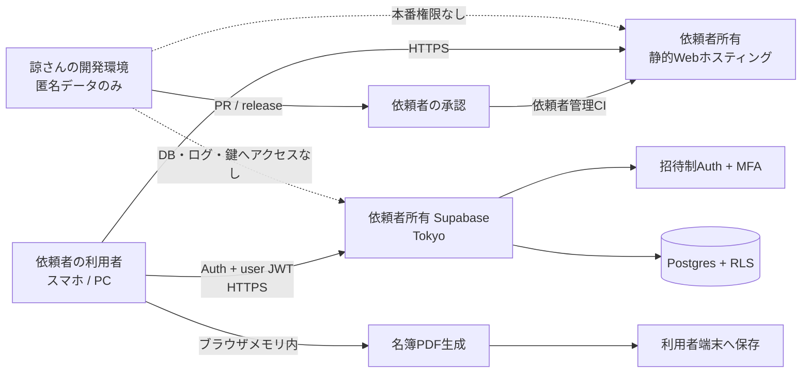

# 本番アプリ アーキテクチャ

- 更新日: 2026-07-16
- 状態: 基本構成を確定
- 初期対象: 依頼者1社専用の作業員名簿MVP
- 前提: 依頼者と受託開発者は別拠点・別ネットワーク。利用はインターネット経由のHTTPS

## 1. 決定事項

1. 本番は依頼者が所有する1社専用環境とする。
2. 本番のGitHub、ホスティング、Supabase、ドメイン、請求、監視、バックアップは依頼者が所有する。
3. 諒さんは納品後、本番メンバー、本番利用者、秘密鍵保有者、本番デプロイ担当者にならない。
4. 開発・レビュー環境は本番と分離し、匿名データだけを使用する。
5. 初期版は自社情報1件と自社作業員だけを扱う。協力会社作業員、所属会社選択、複数組織切替は実装しない。
6. 初期版はオンライン専用とし、端末内の永続DBやオフライン同期を実装しない。
7. 個人情報の正本はSupabase東京リージョンにだけ保持する。
8. 画面配信層では個人情報を処理・保存せず、ブラウザが認証後にSupabaseへ直接接続する。
9. 名簿PDFはブラウザのメモリ上で生成し、クラウドへ保存しない方式を本番第一候補とする。
10. `docs/SECURITY_REQUIREMENTS_JA.md` のP0が完了するまで実データを投入しない。

## 2. 所有権とデータフロー



点線は「アクセスできないこと」を表す。本番のコード反映は、依頼者が承認したcommitを依頼者側CIが実行する。

## 3. 環境構成

| 環境 | 所有者 | データ | 諒さんの権限 | 用途 |
| --- | --- | --- | --- | --- |
| Development | 諒さん | 匿名fixtureのみ | あり | 実装、unit test、UI確認 |
| Review / Staging | 依頼者または引渡し用環境 | 匿名fixtureのみ | 必要時のみ | 依頼者受入、E2E、リリース候補確認 |
| Production | 依頼者 | 実データ | 引渡し後は0 | 実運用 |

本番DBをDevelopmentやStagingへ複製しない。障害再現にはrequest ID、匿名化された技術情報、合成fixtureを使用する。

## 4. 推奨技術構成

| 領域 | 採用方針 | 理由・制約 |
| --- | --- | --- |
| フロントエンド | Vite + React + TypeScript `strict` の静的SPA | SSR/API/Server Actionsを持たず、画面配信層へPIIを送らない境界にする |
| 配信 | 静的buildを顧客所有ホスティングへ配置 | ホスティング側のFunctionへPIIを送らず、app shellだけを配信する |
| UI | CSS変数によるdesign token + アクセシブルなprimitive | v6/v9/roster-uiのUXを本番コンポーネントへ再実装する |
| DB | Supabase Postgres / Tokyo | PIIの正本を1か所に限定する |
| 認証 | Supabase Auth、招待制、TOTP MFA | 一般登録を禁止し、個人別アカウントを使用する |
| 認可 | Postgres RLS + membership + role | UIの表示制御ではなくDBで拒否する |
| PDF | ブラウザ向け`pdf-lib`レンダラーを優先 | PDFをサーバーやStorageへ保存しない。正式様式の品質は専用PoCで確認する |
| バリデーション | Zod等のschemaをUIとdomain境界で共有 | 入力、DB、PDFの判定差を減らす |
| テスト | Vitest等 + Playwright + SQL/RLS test | domain、画面、越境拒否、帳票を分けて検証する |
| CI | lint、format、typecheck、unit、E2E、RLS、secret/dependency scan | 合格したcommitだけをrelease候補にする |

ホスティング事業者は依頼者アカウントで契約する。個人情報をFunction、アクセス解析、session replay、error payloadへ送らないことを採用条件とする。

## 5. フロントエンド境界

```text
src/
├─ routes/                 # 画面とroute。app shellに実データを埋め込まない
├─ features/
│  ├─ auth/
│  ├─ workers/
│  ├─ sites/
│  ├─ site-workers/
│  └─ roster-builder/
├─ domain/                 # 型、業務ルール、validation、issue判定
├─ infrastructure/
│  ├─ supabase/            # publishable key + user JWTだけを使用
│  └─ pdf/                 # client-side renderer
├─ components/             # UI primitiveと共通レイアウト
└─ tests/
```

- 既存の単一HTMLを本番コードへコピーしない。
- `innerHTML`へ利用者文字列を渡さない。
- `localStorage`、`sessionStorage`、IndexedDBへPIIを保存しない。
- Supabase Authは`persistSession: false`としてsessionをメモリ保持し、再読込時は再ログインさせる。
- route名、URL、analytics eventへ氏名や現場名を含めない。
- SSR、server action、ホスティングFunctionでPIIを処理しない構成を初期値とする。

## 6. 最小データモデル

単一顧客専用でも、認可を曖昧にしないためorganization境界を持たせる。複数organizationを作成・切替する製品機能は実装しない。

| テーブル | 目的 |
| --- | --- |
| `organizations` | 依頼者1社の固定所有境界 |
| `user_profiles` | Auth userに対応する表示名と状態 |
| `organization_memberships` | 利用者、役割、active、MFA前提の認可境界 |
| `own_company_profiles` | 自社情報1件 |
| `trades` | 承認された職種マスター |
| `workers` | 自社作業員の帳票必要情報。所属会社FK、健康診断日は持たない |
| `qualification_types` | 承認された資格・教育種別 |
| `worker_qualifications` | 作業員の複数資格・教育。証明書画像は持たない |
| `sites` | 一次会社名、一次会社事業者ID、自社施工次数を含む現場情報 |
| `site_worker_assignments` | 入場日、役割、教育日等の現場別情報 |
| `application_audit_logs` | PII値を持たない追加専用の操作監査 |

全業務テーブルに `organization_id`、作成者、更新者、作成日時、更新日時を必要に応じて持たせる。物理削除、論理削除、匿名化の使い分けは保持・削除表で確定する。

初期の帳票様式1種類は、背景、座標、版、checksumを静的code assetとして固定し、DBやStorageへ保存しない。

## 7. RLSと認証の原則

1. 公開schemaの全テーブルでRLSを有効にする。
2. `auth.uid()`に対応するactive membershipがあり、JWTがMFA済みである場合だけ許可する。
3. `viewer`は読取りのみ、`editor`は承認範囲の業務CRUD、`customer_admin`は利用者・権限管理を行う。
4. roleや`organization_id`をクライアント入力だけで信頼しない。
5. ViewはRLSを迂回しない設定にするか、非公開schemaへ置く。
6. secret key、`service_role`はブラウザで使用しない。招待等で必要な場合は依頼者所有の管理経路へ限定する。
7. 未認証、別organization、無効利用者、MFA未完了、権限外操作を自動テストで拒否する。

## 8. PDF方式

既存PoCは、ChromiumでA3横・8名単位の成立性を確認済みである。本番ではPIIの複製を減らすため、次の順に評価する。

1. 公式背景、座標設定、Noto Sans JPを使うブラウザ向け`pdf-lib`レンダラーを匿名データで作る。
2. 1名、8名、9名、長文、空欄、複数役割、A3横、背景一致、日本語抽出を既存PoCと同じ基準で検証する。
3. 合格した場合はクライアント生成を採用し、生成イベントだけを監査する。
4. 合格しない場合は、依頼者所有の一時生成環境を別途審査する。公開URLや永続Storageは使用しない。

資格名が収まらない場合の「別紙参照」は、別紙様式が確定するまで本番の完了条件として残す。

## 9. リリースと引渡し

### 構築中

1. 匿名データだけでコード、migration、RLS、テストを作成する。
2. 依頼者所有の空の本番環境へrelease候補を適用する。
3. 匿名データで受入試験とセキュリティ試験を行う。

### 本番開始前

1. 依頼者がGitHub、ホスティング、Supabase、DNS、監視の所有者であることを確認する。
2. 諒さんと一時アカウントを全サービスから削除する。
3. 依頼者が全secret、DB credential、deploy tokenを再発行する。
4. 依頼者だけで利用者無効化、鍵交換、バックアップ確認、デプロイ停止ができることを確認する。
5. `docs/SECURITY_REQUIREMENTS_JA.md` のP0を承認する。
6. ここまで完了してから実データを登録する。

### 納品後の更新

- 諒さんは匿名環境で修正し、PRまたはreleaseを提出する。
- 依頼者が差分とテスト結果を承認する。
- 依頼者管理CIが承認済みcommitだけを本番へ反映する。
- 本番障害の再現に実データ、実PDF、実画面キャプチャを使用しない。

## 10. 実装順序

| Phase | 内容 | 完了条件 |
| --- | --- | --- |
| 0B | セキュリティ要件、所有権、構成、データ台帳 | P0項目と未決定事項が明文化される |
| 1 | 本番用フロント基盤、design token、CI | lint、typecheck、unit、build、360/390/430pxが合格する |
| 2 | Supabase schema、招待制Auth、MFA、RLS、監査 | 未認証・権限外・別organizationを拒否する |
| 3 | 自社情報、作業員、現場、現場別情報 | 承認項目のCRUDと不足判定が動く |
| 4 | 名簿作成5工程 | 現場選択から不足0までスマホで完了する |
| 5 | client-side PDF 1様式 | A3横・境界値・日本語・背景差分が合格する |
| 6 | 顧客受入、権限削除、秘密ローテーション、運用訓練 | P0全件合格後に本番開始できる |

日報、月次日報、出面表は、名簿MVPの本番受入後に別フェーズで実装する。

## 11. 本番実装前に残る依頼者判断

- 初期利用者数と `customer_admin` / `editor` / `viewer` の割当て
- 現場ごとの閲覧制限が必要か
- 作業員、退職者、現場、ドラフト、監査ログの保持期間
- 利用端末が会社管理端末かBYODか
- PDFをどこへ提出し、ダウンロード後にどう保管・削除するか
- 国交省作成例を実提出でそのまま利用できるか
- 「別紙参照」の正式な別紙様式

これらのうち、schema、認可、保持、帳票の正しさに影響する項目は、該当Phase着手前に承認する。
